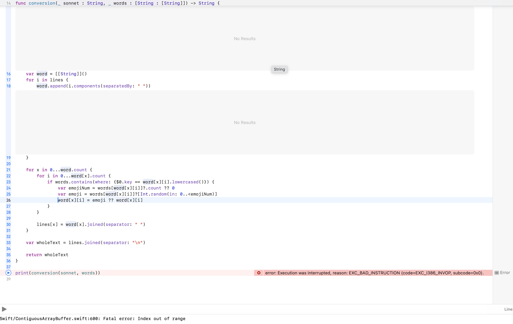

## If Shakespeare was texting now...

In this text art assignment, I based on my on Shakespear's work of sonnets. This assignment imagined Shakespeare using smartphones and writing his sonnets with the modern technology. One of the prominent featurs of modern users of texting is the use of emojis, and emojis are the most common text art used the by public nowadays. Therefore, in this assignment, I transcribed some elements of Shakespeare's sonnets with random emojis of similar meanings. 

Do these emojis express a more vivd message and emotion than plain texts? Can emojis be interpreted in different ways by various readers? These are all the themes this assignment attempted to explore.

Technically, I incorporated functions, variables, for loops, and random numbers as well as arrays and dictionaries. As the first Swift project of mine, I have encountered different issues, most of which were due to the fact that Swift is different from all the programming languages I have ever used. 

Here are two main issues I ran into and learnt solutions:

1. Range in for loops:

In other languages, the upper bound of the range in for loops is usually not included. But in Swift, it is included. Therefore, I ran into this issue at first:

